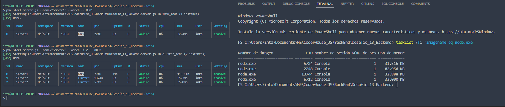

# **Desafío: SERVIDOR CON BALANCE DE CARGA**. Curso CoderHouse Backend Node.Js

## Consignas:

Tomando con base el proyecto que vamos realizando, agregar un parámetro más en la ruta de comando que permita ejecutar al servidor en modo fork o cluster. Dicho parámetro será 'FORK' en el primer caso y 'CLUSTER' en el segundo, y de no pasarlo, el servidor iniciará en modo fork.

● Agregar en la vista info, el número de procesadores presentes en el servidor.

● Ejecutar el servidor (modos FORK y CLUSTER) con nodemon verificando el número de procesos tomados por node.

● Ejecutar el servidor (con los parámetros adecuados) utilizando Forever, verificando su correcta operación. Listar los procesos por Forever y por sistema operativo.

● Ejecutar el servidor (con los parámetros adecuados: modo FORK) utilizando PM2 en sus modos modo fork y cluster. Listar los procesos por PM2 y por sistema operativo.

● Tanto en Forever como en PM2 permitir el modo escucha, para que la actualización del código del servidor se vea reflejado inmediatamente en todos los procesos.

● Hacer pruebas de finalización de procesos fork y cluster en los casos que corresponda.

Configurar Nginx para balancear cargas de nuestro servidor de la siguiente manera: Redirigir todas las consultas a/api/randomsa un cluster de servidores escuchando en el puerto 8081. El cluster será creado desde node utilizando el módulo nativocluster. El resto de las consultas, redirigirlas a un servidor individual escuchando en el puerto 8080. Verificar que todo funcione correctamente. Luego, modificar la configuración para que todas las consultas a/api/randomssean redirigidas a un cluster de servidores gestionado desde nginx, repartiéndolas equitativamente entre 4 instancias escuchando en los puertos 8082, 8083, 8084 y 8085 respectivamente.

Incluir el archivo de configuración de nginx junto con el proyecto. Incluir también un pequeño documento en donde se detallen los comandos que deben ejecutarse por línea de comandos y los argumentos que deben enviarse para levantar todas las instancias de servidores de modo que soporten la configuración detallada en los puntos anteriores.

Ejemplo:

● pm2 start ./miservidor.js -- --port=8080 --modo=fork

● pm2 start ./miservidor.js -- --port=8081 --modo=cluster

● pm2 start ./miservidor.js -- --port=8082 --modo=fork
●...

## Como ejecutar el proyecto:

* Ejecutar el comando `npm install`
* Se debe crear un archivo de configuraracion `.env` con los siguientes datos

```
MONGO_USER = "<usuario Mongo Atlas>"
MONGO_PASS = "<contraseña Mongo Atlas>"
MONGO_CLUSTER = "<@clusterx.asd123.mongodb.net/test>"
GOOGLE_APLICATION_CREDENTIALS = "<google credentials>"
PUERTO = 8080
```

* Ejecutar el comando `npm run start` o ` npm run start -- --puerto <n° de puerto>`
* Para probar/testear los diferentes rutas y funcionalidades, se recomienda utilizar [Postman](https://www.postman.com/downloads/)

## Resolución:

Iniciamos el proyecto en modo FORK con nodemon:

+ npm start 8080


Iniciamos el proyecto en modo CLUSTER con nodemon:

+ npm start 8081 CLUSTER


Iniciamos el proyecto en modo FOREVER, en los puertos 8081 y 8082:

+ forever start server.js 8081
+ forever start server.js 8082

Listamos los PID:


Iniciamos ejecucion con PM2 en modo FORK y CLUSTER, se crean 2 servidores con puertos 8081 y 8082:




Iniciamos ejecucion con PM2 en modo FORK y CLUSTER, con NGINX:


